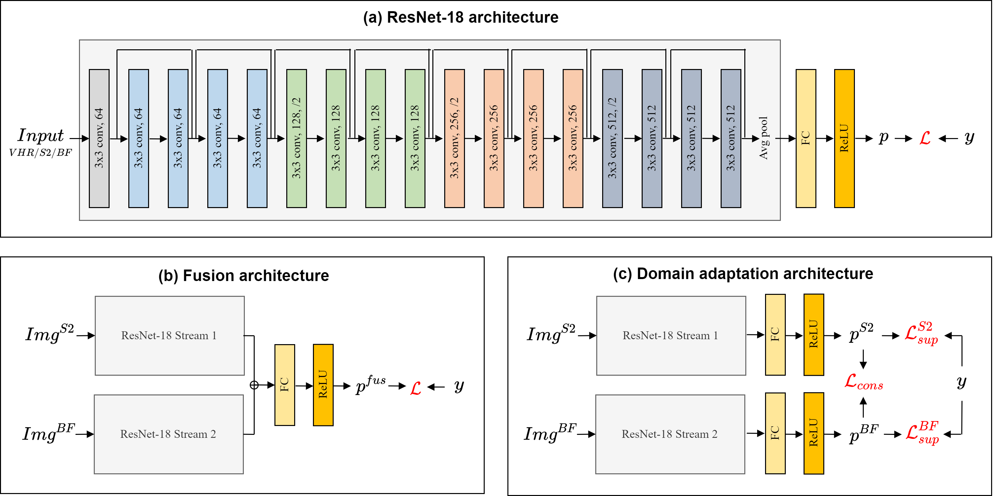

Code for the following paper:

S. Georganos, S. Hafner, M. Kuffer, C. Linard and Y. Ban, "A census from heaven: Unravelling the potential of deep learning and Earth observation for intra-urban population mapping in data scarce environments," in *International Journal of Applied Earth Observation and Geoinformation*, (under review).


# Abstract

Urban population distribution maps are vital elements for monitoring the Sustainable Development Goals, appropriately allocating resources such as vaccination campaigns, and facilitating evidence-based decision making.  Typically, population distribution maps are derived from census data from the region of interest. Nevertheless, in several low- and middle-income countries, census information may be unreliable, outdated or unsuitable for spatial analysis at the intra-urban level, which poses severe limitations in the development of urban population maps of adequate quality. To address these shortcomings, we deploy a novel framework utilizing multisource Earth Observation (EO) information such as Sentinel-2 and very-high-resolution Pleiades imagery, openly available building footprint datasets, and deep learning (DL) architectures, providing end-to-end solutions to the production of high quality intra-urban population distribution maps in data scarce contexts. Using several case studies in a Sub-Saharan Africa, namely Dakar (Senegal), Nairobi (Kenya) and Dar es Salaam (Tanzania), our results emphasize that the combination of DL and EO data is very potent and can successfully capture relationships between the retrieved image features and population counts at fine spatial resolutions (100 meter). Moreover, for the first time, we used state-of-the-art domain adaptation methods to  predict population distributions in Dar es Salaam and Nairobi (R$^2$ = 0.39 – 0.60) that did not require national census or survey data from Kenya or Tanzania, but only a sample of training locations from Dakar. The DL architecture is based on a modified ResNet-18 model with dual-streams to analyze multi-modal data. Our findings have strong implications for the development of a new generation of urban population products that are an output of end-to-end solutions, can be updated frequently and rely completely on open data.

# Proposed models





# Reproducing results

## 1 Dataset download
  
TBA

## 2 Network training

There are three training files that can be run with different configs for model training (e.g. python training_file.py -c config_file):

- For (a) uni-modal models, run the file train_unimodal.py with the configs vhr, s210m or bf.
- For (b) the late fusion model, run the file train_fusion.py with the config s210m_bf_lf.
- For (c) the proposed domain adaptation model, run the file train_domainadaptation.py with the config s210m_bf_da.


## 3 Assessment

The file assessment.py contains a collection of functions to quantitatively and qualitatively assess network performance.

# Credits

If you find this work useful, please consider citing:


  ```bibtex

  ```